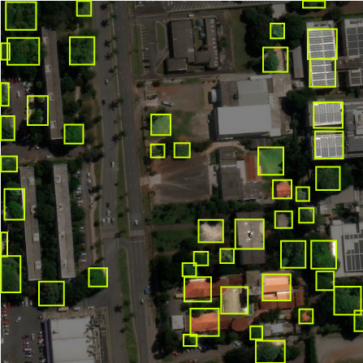
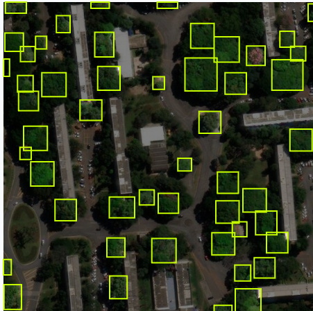
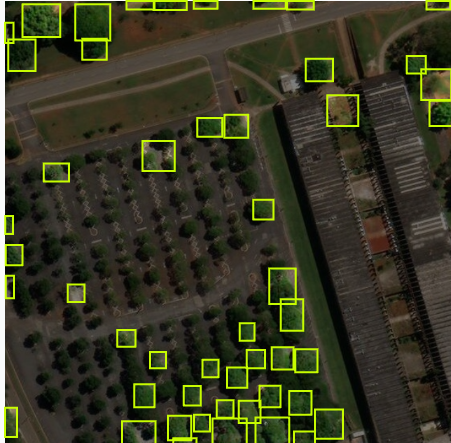

# Card 2.5 — Revisão de Qualidade: Problemas Identificados nas Pseudo-Labels do DeepForest

**Etapa:** Núcleo 2 — Curadoria & QA

---

## Problemas Encontrados

### 1. Prédios marcados como árvores (Falsos Positivos)
O DeepForest detectou coberturas de edificações como copas de árvores, especialmente em telhados com vegetação ao redor ou com textura similar à copa.

---

### 2. Conglomerados de árvores marcados como uma única árvore (Sub-segmentação)
Grupos densos de copas próximas foram agrupados em uma única caixa delimitadora grande, em vez de caixas individuais por copa.

---

### 3. Árvores não marcados (Falsos Negativos)
Áreas com baixa densidade arbórea não receberam nenhuma anotação — o modelo falhou em detectar completamente regiões de copa muito espaçada.

---

## Ação de Curadoria

As correções foram aplicadas manualmente no Roboflow:
- Caixas incorretas (prédios, sombras) foram removidas.
